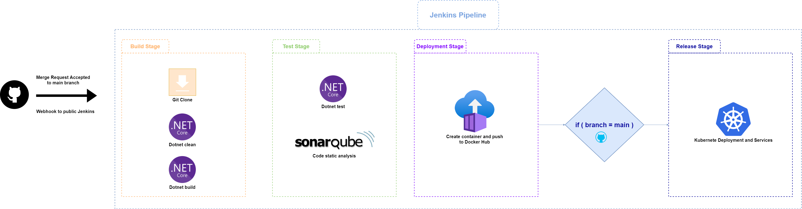

# NetCoreDockerJenkinsSonarK8s 🎓🏭
# LaSalle – Modelos de desarrollo del software 

# Contenido 📇

* 1. Idea principal
* 2. Instalación 
* 3. Resultados

# 1. Idea principal 🤔💭

* Desarollar una aplicación servidor con un endpoit REST que devuevela un HelloWorld (Dotnet). Realizar test unitario de dicha clase/función.

** **Extra**: Utilización de Swagger/OpenAPI para las especificaciones RESTful.

* Realizar un ciclo de integración continua (pipeline), con los siguientes stages:

  * **Build**: Clean - Build - Static code analysis (Sonarqube)
  * **Test**: Dotnet execute unit test
  * **Deploy**: Create docker image - push docker hub
  * **Orchestrate**: kubernetes apply deploytment and services

** **Extra**: utilización de webhooks para lanzar el trigger de merge en la rama main.

## Stack tecnologico 🧱🔧

## Jenkins Pipeline Diagram 🔄

# 2. Instalación 
 Programas utilizados:

* **Jenkins** página oficial: https://www.jenkins.io/download/
  + Utilizamos el puerto 8080 que se encuentra publico en el servidor para poder lanzar el trigger (Webhook).
* **Sonarqube** página oficial: https://www.sonarqube.org/downloads/ 
  + Utilizamos el puerto 9000 para poder enlazar el analizador de código estático (Stage test pipeline).
* **Docker** página oficial: https://docs.docker.com/docker-for-windows/install/
  + Generamos nuestra imagen docker a traves del fichero Dockerfile y lo subimos al Docker Hub (Deployment).
* **Minikube** página oficial: https://kubernetes.io/es/docs/tasks/tools/install-kubectl/
  + Encargado de desplegar los pods (imagenes de docker) y establecer los diferentes servicios.

#### Dirección publica (Servidor)

http://whiskicasa.tplinkdns.com

# 3. Resultados