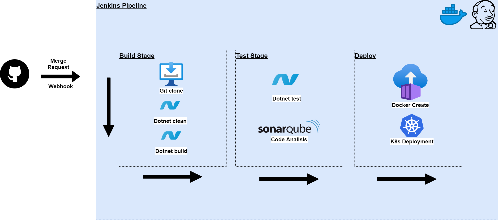
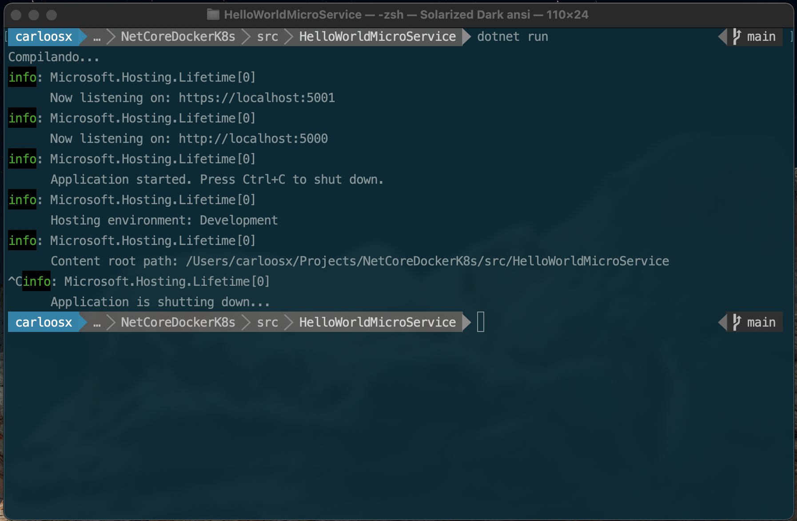

# NetCoreDockerJenkinsSonarK8s 🎓🏭
# LaSalle – Modelos de desarollo del software 🤖


# Contenido 📇

* 1. Idea principal
* 2. Instalación 
* 3. Resultados


# 1. Idea principal 🤔💭

* Desarollar una aplicación servidor con un endpoit REST que devuevela un HelloWorld (Dotnet). Realizar test unitario de dicha clase/función.

** **Extra**: Utilización de Swagger/OpenAPI para las especificaciones RESTful.

* Realizar un ciclo de integración continua (pipeline), con los siguientes stages:

  * **Build**: Clean - Build - Static code analysis (Sonarqube)
  * **Test**: Dotnet execute unit test
  * **Deploy**: Create docker image - push docker hub
  * **Orchestrate**: kubernetes apply deploytment and services

** **Extra**: utilización de webhooks para lanzar el trigger de merge en la rama main.

## Stack tecnologico 🧱🔧


## Jenkins Pipeline Diagram 🔄



# 2. Instalación 

```
https://dotnet.microsoft.com/download
```

### Run The app 

#### Go to project path 

```
NetCoreDockerK8s/src/HelloWorldMicroService
```

#### Execute the app

```
dotnet run
```

#### You will see something like this



#### Run Test

#### Go to project path

```
NetCoreDockerK8s/src/HelloWorldMicroService
```

#### Execute the app

```
dotnet test
```

#### Application

### Base url

http://whiskicasa.tplinkdns.com

### Ports

8080
9000

# 3. Resultados